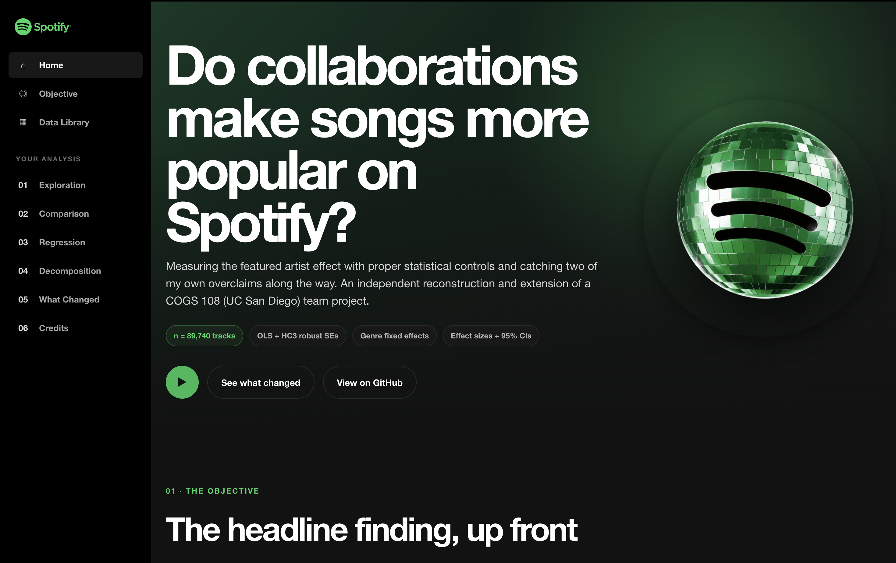
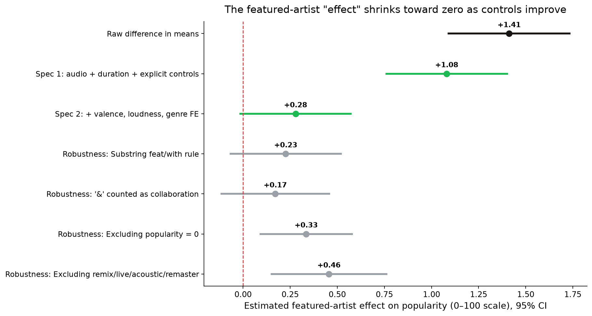
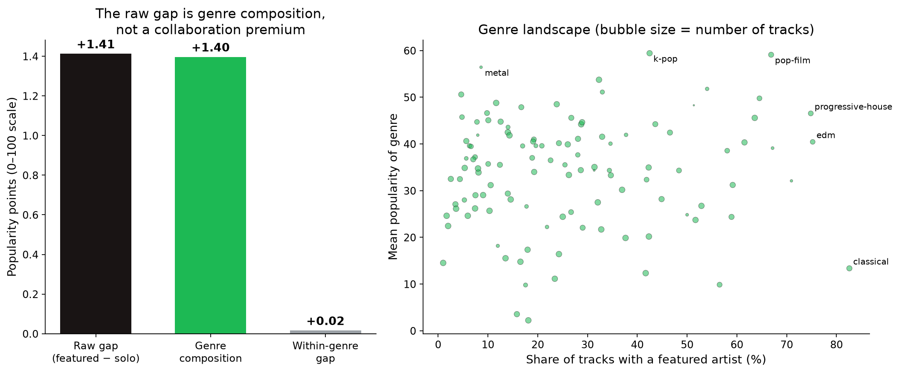

# Do Collaborations Make Songs More Popular on Spotify?

Check it out here: https://sonalishyma.github.io/Impact-of-Featured-Spotify-Artists/ 

## Project Preview



**Measuring the featured-artist effect with proper controls — and catching our own overclaim.**


Featured tracks look more popular than solo tracks on Spotify (p ≈ 1e-26). This project shows that the gap is **tiny (+1.4 points on a 0–100 scale, Cohen's d ≈ 0.07)** and that **99% of it is genre composition, not collaboration**: featured tracks simply sit in genres that are more popular. Inside the same genre, the featured-vs-solo gap is **+0.02 points — effectively zero**. With genre and audio-feature controls, the estimated effect is **+0.28 points (95% CI −0.01 to +0.57, p = 0.06)** and stays between roughly zero and half a point across every robustness check.



## Provenance and attribution

The original analysis was a five-person **COGS 108 (UC San Diego)** team project — Jose Enrique Siono Gutierrez, Zulema Zermeno, Sahar Zahir, **Sonali Singh**, Teresa Jia — where my roles were **analysis, background research, visualization, and writing (original draft)**.

This repository is my **independent reconstruction and extension** of that project. The team's original processed files were lost after the course ended, so I re-identified the source dataset by matching summary statistics from our final presentation (89,740 unique tracks; explicit split 82,036/7,704; group means 32.81/34.26 — this rebuild reproduces all of them to within one row). The extension completes what our project proposal specified but the final presentation never delivered: an **OLS regression with HC3 robust standard errors, genre fixed effects, effect sizes with confidence intervals, VIF diagnostics, and robustness checks** across alternate definitions of "featured."

**What changed vs. the original conclusion.** Our final presentation read the p-value (≈1e-29) as evidence that featured artists "meaningfully boost" popularity. The completed analysis shows the original computation was correct but the conclusion overclaimed: at n ≈ 90,000, statistical significance is nearly guaranteed for any nonzero difference. The analytical question was always effect *size* — and the answer is: negligible within genre, in this catalog snapshot.

**A second self-caught error, this time in my own extension.** The first version of the genre decomposition below compared each group's genre exposure to a *blended* genre-level popularity mean (mixing featured and solo tracks together). That's a natural thing to write, but it's not algebraically correct: the two components didn't sum back to the raw gap — they landed about 0.4 points short, because the blended mean already absorbs part of the within-genre effect it's supposed to be separate from. `tests/test_regression.py::test_genre_decomposition_sums_to_raw_gap` catches exactly this (composition + within must equal the raw gap, no residual), which is what surfaced it. The fix is a proper shift-share decomposition weighted by each genre's solo-track mean; genre composition explains **99%** of the raw gap, not 73% as an earlier draft of this README stated — the within-genre conclusion (≈0) is unchanged either way.

## Research question

> Do tracks featuring at least one other artist have higher Spotify popularity than solo tracks, controlling for duration, explicitness, and audio features (energy, danceability)?

- **H₀:** after adjustment, the coefficient on `has_feature` = 0.
- **H₁:** after adjustment, featured tracks have higher popularity on average.

## Data

**Spotify Tracks Dataset** (maharshipandya; distributed via Kaggle/Hugging Face) — 114,000 track–genre rows with Spotify's `popularity` score (0–100), `explicit` flag, audio features, and `track_genre`. After deterministic deduplication by `track_id` and removal of nonpositive durations: **89,740 unique tracks**. A copy is included at `data/dataset.csv` (~20 MB) so the notebook runs out of the box; `src/get_data.py` re-downloads it from source.

`has_feature = 1` if a track lists multiple artists or its title contains a featuring marker (`feat.`, `ft.`, `featuring`, `with` as whole words). The original team's exact rule could not be fully reverse-engineered (their featured count was 24,876 vs. 23,058 here — they likely also counted "&"); the robustness section shows conclusions are unchanged across definitions, including the "&" variant.

## Data cleaning

The shared cleaning pipeline removes the source index column, keeps the first row for each `track_id`, removes nonpositive durations, converts the explicit flag to binary, converts duration to seconds, and creates `has_feature` from multiple artists or title markers such as `feat.`, `ft.`, `featuring`, and `with`. The notebook and tests import the same cleaning function so their definitions cannot silently drift.

## Regression analysis (OLS with genre fixed effects)

The completed analysis estimates OLS models with HC3 robust standard errors. Specification 1 controls for duration, explicitness, energy, and danceability. Specification 2 adds valence, loudness, and fixed effects for 114 genres. The featured artist coefficient falls from 1.08 points in Specification 1 to 0.28 points in Specification 2, with a 95% confidence interval from −0.01 to 0.57.

The analysis also includes an exact shift share decomposition, VIF diagnostics below 2.6, alternate featured artist definitions, a version excluding zero popularity tracks, and a version excluding remix, live, acoustic, and remastered tracks.

## Hypothesis testing

The reported regression test evaluates **H₀: the adjusted featured artist coefficient equals zero** against the two sided alternative that it differs from zero. The fully adjusted estimate has `p = 0.062`, and its 95% confidence interval includes zero, so the analysis does not reject the null at the 5% level.

The raw Mann Whitney comparison is statistically significant at approximately `p = 4.2e−26`, but the raw effect is only 1.41 points with Cohen's `d = 0.07`. With a sample near 90,000 tracks, this distinction between statistical significance and practical magnitude is central to the conclusion.

## SQL analysis

Seven SQLite queries independently reproduce the cleaning audit, group averages, raw popularity gap, collaboration shares by genre, within genre differences, exact genre composition decomposition, and zero popularity sensitivity check. See the [SQL analysis guide](./sql/README.md), [queries](./sql/analysis.sql), and [recorded results](./sql/results.md).

## Results

| Estimate of the featured-artist effect | Points (0–100) | 95% CI | p |
|---|---|---|---|
| Raw difference in means | **+1.41** | [+1.10, +1.72] | ≈1e-26 (M-W) |
| Spec 1: duration + explicit + energy + danceability | **+1.08** | [+0.76, +1.40] | 4e-11 |
| Spec 2: + valence + loudness + **genre FE** | **+0.28** | [−0.01, +0.57] | 0.062 |
| Robustness range (4 variants, Spec 2) | +0.17 to +0.46 | — | — |

**Decomposition of the raw +1.41:** genre composition **+1.40 (99%)**; within-genre gap **+0.02 (1%)**.



**Interpretation.** Collaborations are concentrated in genres (dancehall, hip-hop, reggaeton) whose tracks are more popular on average; once you compare featured and solo tracks *within* a genre, the difference disappears. Spec 2's R² jumps to 0.33 (from 0.007) — genre explains a third of popularity variance; collaboration explains almost none.

**Why this differs from stream-based studies** reporting ≥5% more streams for collaborations: different outcome (Spotify's recency-weighted popularity score, not stream counts), different sample (a broad catalog snapshot, not new chart releases), and unobserved **artist fame** — which biases this estimate *upward* if anything (famous artists collaborate more *and* are more popular), making the near-zero adjusted effect more credible, not less.

## Limitations

Popularity is a platform-defined, recency-weighted score; genre is one label per track from the source's playlist assignment; release year is unavailable; the data are a snapshot (no popularity trajectories); and no causal claim is possible — artists choose when to collaborate.

## Repository structure & how to run

```
├── README.md
├── requirements.txt
├── data/
│   ├── dataset.csv          # included (~20 MB) so the notebook runs as-is
│   └── README.md            # provenance
├── src/
│   ├── clean.py             # shared dedup + has_feature pipeline (notebook and tests both import this)
│   └── get_data.py          # re-download the dataset from source
├── notebooks/analysis.ipynb # full analysis, executed
├── tests/                   # data-integrity and regression sanity checks (pytest)
└── results/
    ├── figures/             # all figures (PNG, 160 dpi)
    └── summary.json         # key estimates, machine-readable
```

```bash
python -m venv .venv && source .venv/bin/activate
pip install -r requirements.txt
jupyter nbconvert --to notebook --execute --inplace notebooks/analysis.ipynb
pytest tests/
```

## References

1. Rolling Stone (2019). *Songs With Featured Artists Have a Better Shot at Being a Hit.*
2. Macquarie Business School (2019). *There's more to musical collaborations than money.*
3. Ordanini, Nunes & Nanni (2020, working paper). *It takes two, baby! Feature artist collaborations and streaming demand for music.*
4. Suh, B. J. (2019). *An Analysis of the Determinants of Song Popularity.* Claremont McKenna College.
5. Nijkamp, R. (2018). *Explaining song popularity by audio features from Spotify data.* University of Twente.
6. Saragih, H. S. et al. (2023). *Predicting song popularity based on Spotify's audio features.* Cogent Engineering.
7. Spotify Web API documentation — track `popularity` definition (0–100, recency-weighted).
